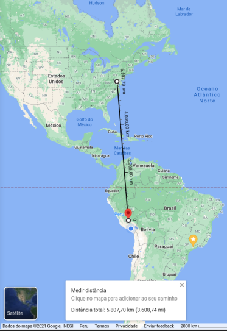

# Delivery App built from zero to hero


> A simple app to calculate distance between two points built with Django, PostgreSQL and JavaScript


Accurate results !



Check it out here: [delivery-spike](https://delivery-spike.herokuapp.com/app/index.html)

Delivery App is a sample app to showcase the following features:

- API: A simple API built with Django
- Frontend: Simple frontend app built with HTML / CSS / JavaScript
- Production-ready app: Configured to be deployed on an NGINX server using gunicorn. NGINX server serves as a proxy to redirect between the API and the frontend app.
- CI/CD pipeline: Automatize the unit tests, linters (for commits and code to follow the common standards) and deployment to Heroku Container Registry via Docker using Github Actions.
- Setup of test, development and production environments using docker-compose.

## Technologies used

- Django
- HTML / CSS / JavaScript
- PostgreSQL
- nginx
- gunicorn
- NPM
- Docker and Docker Compose
- Github Actions
- Heroku CLI

## Installation

### Development environment

Run the following command to launch the development environment with Docker:

```
docker-compose -f docker-compose.dev.yml build
docker-compose -f docker-compose.dev.yml up
```

Open [localhost:8000/app/index.html](localhost:8000/app/index.html). The app will show debug information if something goes wrong.

### Testing environment

Run the following command to launch the testing environment with Docker:

```
docker-compose -f docker-compose.test.yml build
docker-compose -f docker-compose.test.yml up
```

First the app will run the linters ESLint and Flake8 to check the format of the code. Then the app will run the unit test for the frontend and the backend. The results will match the CI/CD pipeline on Github Actions, so the debugging will be more easier.

### Production environment

Run the following command to launch the production environment with Docker:

```
docker-compose -f docker-compose.prod.yml build
docker-compose -f docker-compose.prod.yml up
```

Open [localhost:8000/app/index.html](localhost:8000/app/index.html). The app will NOT show debug information if something goes wrong. The app is using NGINX and gunicorn as a reverse-proxy to serve static files and the API from Django.

## Roadmap

Report and issue and propose new features [here](https://github.com/yg-apaza/delivery/issues).

## License

Distributed under the MIT License. See ```LICENSE``` for more information.

## Acknowledgments

- [Dockerizing a Python Django Web Application](https://semaphoreci.com/community/tutorials/dockerizing-a-python-django-web-application)
- [Dockerizing Django with Postgres, Gunicorn, and Nginx](https://testdriven.io/blog/dockerizing-django-with-postgres-gunicorn-and-nginx/)
- [Django with Nginx, Gunicorn. A Production Ready Solution](https://medium.com/analytics-vidhya/dajngo-with-nginx-gunicorn-aaf8431dc9e0)
- [Deploying containerized NginX to Heroku - how hard can it be?](https://dev.to/levelupkoodarit/deploying-containerized-nginx-to-heroku-how-hard-can-it-be-3g14)
- [How to find the distance between two lat-long coordinates in Python
](https://www.kite.com/python/answers/how-to-find-the-distance-between-two-lat-long-coordinates-in-python)